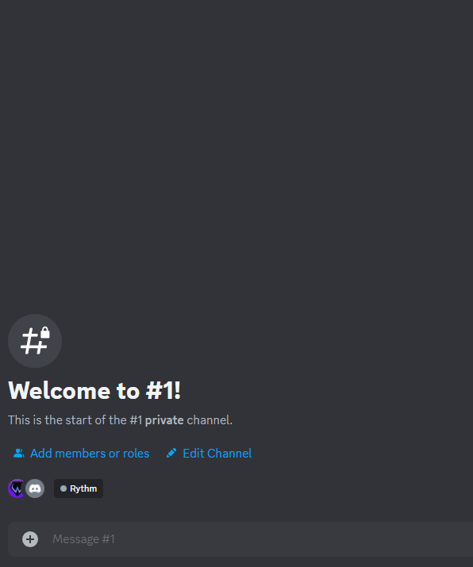

<a href="https://knr.edu.pl/">
    
</a>

# Discord Bot

<div align="center">

<p align="center">
    
</p>

This project aims to create a personalized bot to help with server management on discord, using the `discord.py` library. At the moment the project is in the development phase. Ultimately, the bot is supposed to aid with writing complex text messages on the channel that contain relevant server data.


[Getting started](#getting-started) •
[Discord Commands](#discord-commands) •
[Embed Creator Example](#embed-creator-example) •
[Message Syntax](#message-syntax) •
[License](#license)

</div>
&nbsp;

## Getting started

---

1. Create a Bot account. For this, you can find many tutorials on the web. I personally recommend [this](https://discordpy.readthedocs.io/en/stable/discord.html) or [that one](https://www.androidpolice.com/how-to-make-discord-bot/).

2. Install necessary libraries in terminal:

   ```powershell
   pip install -r requirements.txt
   ```

3. If you decide to run your bot from a personal computer, with only you having access to the code, you can replace `DISCORD_TOKEN` , as well as `GUILD_ID` variable instances inside the quotes in the `bot.py` with your token acquired when creating the bot and server ID numer:

   ```python
   client.run(os.getenv("DISCORD_TOKEN"))

   discord.Object(id=os.getenv("GUILD_ID"))
   ```

   Otherwise, it is advised to store your token and ID number in a separate file. For this create `.env` file inside the same folder as the `bot.py` file. You should store both values like so:

   ```python
   DISCORD_TOKEN="Your token goes here"
   GUILD_ID="The ID number of your server goes here"
   ```

   If you want to place this bot on your github account, before doing so you should create an empty `.gitignore` file, where you should write:

   ```text
   .env
   ```

   This will prevent git from accidentally sending your token for others to see.

4. You can now run your bot. Open a command line and change the directory to the path of your bot files. Next type in the word python, or python3 if you have both versions, followed by the file name of your bot, like this:

   ```text
   python3 bot.py
   ```

## Discord commands

---
<p align="center">

</p>

_!help_ - shows bot usage instruction **[Function not Ready Yet]**

_!hello_ - Reads the message from the chat. Returns a greeting.

_!server_ - Reads the message from the chat and returns embedded message with server stats

_/embed_creator_ (or _!embed_creator_) - Creates Embed Creator - A tool for dynamic embed building. It allows you to change various parameters of the embed live and then choose the channel on which the embed will be published. When changing description of the embed, or text value inside added text field, you can use supported [commands](#message-syntax).

_/embed_update_ (or !_embed_update_) - Loads, if exists, the last embed sent. Lets you edit the embed with the same menu as _!embed_creator_, without having to deploy the new message.

## Embed Creator Example

---

<p align="center">

</p>

## Message Syntax

---

The bot can convert relevant commands in text into valuable information when you invoke `/embed_creator` or `!embed_creator` discord commands and try to edit either embed description or add and edit a text field. When typieng the message, commands are recognized inside curly brackets `{}`. Each command should be written in a separate function block. For every command listed below must provide a suitable argument or arguments in place of `[...]`. Currently, the possible commands recognized in the text:

- `{list_members [...]}` - Returns a list of members who have required roles. In addition to roles, the text can include the logical operators `and`/`or` and `not`. The `and` operator reads the role directly before and after itself and checks the logical condition, which members belong to both roles. Similarly, the `or` operator works - checks all members who match one or both roles. The `not` operator reads the role after itself and returns all members who do not have the assigned role.
  The real power of the list_members command comes from the fact that the operators in the function block can be duplicated and combined to form a complex function for searching server data. For example, by typing `{list_members a and b and c not d not e}`, you should get every person who has both role a and b, but no role c, d and e.

  > **Important**: You cannot use both `and` and `or` operators in the same sentence, but you can use any of them with the `not` command.
  >
  > **Important**: If you want to use both the `not` operator and any of the other operators in the same command, you must use all operators that are not `not` in the first place. Example: `{count_members not A and B and C}` is incorrect and will return `[None]`.

- `{count_members [...]}` - Works like `list_members`, but instead of returning names, it returns a number.

- `{member [...]}` - Used to search for a single member from a server. You have to provide a user name from a server in the format "name#XXXX" in place of `[...]`, where "XXXX" is a 4-digit number. In response, the function will return a formatted name that looks like: **@Name**. In addition, if a user has a special nickname set for this server, it will be shown instead of his default name.

- `{role [...]}` - Searches for a specific role in the server. Returns a formatted role name that looks like **@Role**. You have to provide a role name in the place of `[...]`.

- `{text_channel [...]}` - Searches for a specific text channel in the server. Returns a formatted text channel name that looks like **#TextChannel**.

- `{voice_channel [...]}` - Searches for a specific voice channel in the server. Returns a formatted voice channel name that looks like **@VoiceChannel**.

> **In case of an incorrect argument name in the text, a missing argument, or an argument that does not exist in the Discord server database, the bot will return `[None]`**.

Examples:

> There are currently {count_members xyz} members one the server with the role {role Moderator}.
>
> These members are: {list_members Moderator}.
>
> The {role President} of a club is {member John#1234}.
>
> Incorrect command examples: {list_members }, {count_members president}, {member Name#1234567}

Result:

> There are currently 3 members one the server with the role **@Moderator**.
>
> These members are: **@A**, **@B**, **@C**.
>
> The **@President** of the club is **@John**.
>
> Incorrect command examples: [None], [None], [None]

In the incorrect commands' examples above: 1. Empty argument, 2. case sensitive argument (starts with lower "p"), 3. Too long user name number.

## License

---

Copyright © 2022 KNR

This project is [MIT](https://choosealicense.com/licenses/mit/) licenced.
